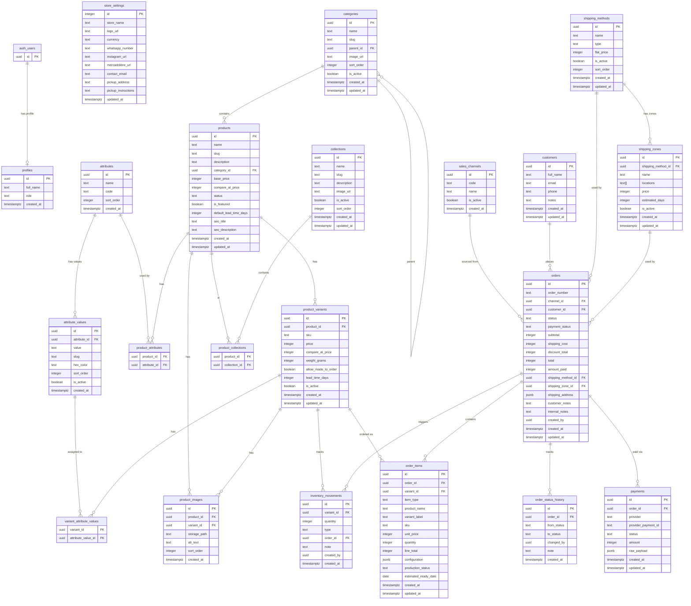

# Diagrama ER — Encantika

## Notas

| Tabla | Notas especiales |
|-------|-----------------|
| `store_settings` | Fila singleton forzada por `CHECK (id = 1)` |
| `inventory_movements` | Ledger inmutable — reglas PostgreSQL bloquean UPDATE y DELETE |
| `variant_stock` | Vista que suma `quantity` de `inventory_movements` por variante |
| `orders.order_number` | Generado por secuencia SQL (`JY-000001` en adelante) |
| Precios | Todos en `integer` (centavos CLP — e.g. `3990` = $3.990) |
| `is_admin()` | Función `SECURITY DEFINER` usada en todas las políticas RLS |
