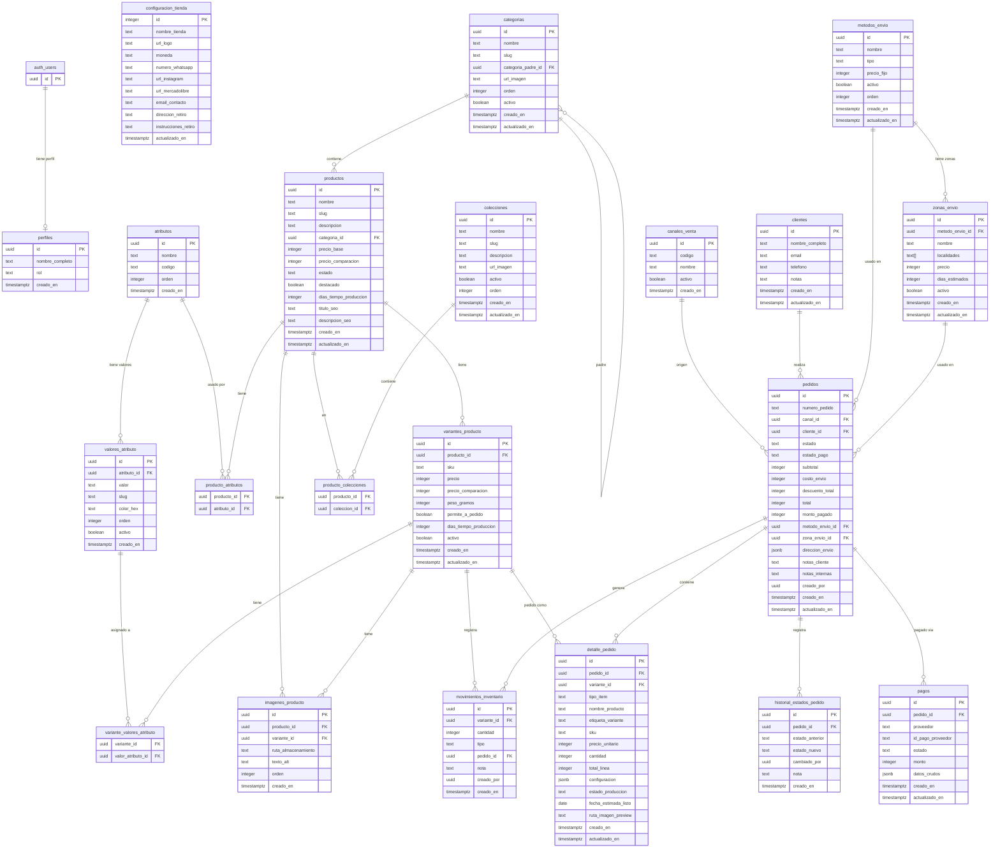

# Diagrama ER — Encantika

## Notas

| Tabla/Vista | Notas especiales |
|-------------|-----------------|
| `configuracion_tienda` | Fila singleton forzada por `CHECK (id = 1)` |
| `movimientos_inventario` | Ledger inmutable — trigger bloquea UPDATE y DELETE (bypass solo via `limpiar_datos_prueba()`) |
| `stock_variantes` | Vista con `security_invoker=true`; suma `cantidad` de `movimientos_inventario` por variante |
| `pedidos.numero_pedido` | Generado por secuencia SQL `pedidos_numero_seq` (`JY-000001` en adelante) |
| Precios | Todos en `integer` (CLP entero — e.g. `3990` = $3.990) |
| `es_admin()` | Funcion `SECURITY DEFINER` usada en todas las politicas RLS |
| `obtener_disponibilidad_variantes()` | `SECURITY DEFINER`; expone solo booleanos, nunca el stock exacto |
| `limpiar_datos_prueba()` | Solo ejecutable con `service_role`; usada por `scripts/test-rls.ts` |
